# Dental Store
## Information
  Repositories frontend: <a href="https://github.com/minnku17/FrontendDentalStore" target="_blank">FrontendDentalStore</a> </br>
  Deploy to vercel: <a href="https://frontend-dental-store.vercel.app/" target="_blank">Dental Store</a><span> | </span><a href="https://frontend-dental-store.vercel.app/login-admin" target="_blank">Dashboard Admin</a><span>(email: admin@gmail.com | pass: 12345)</span></br>
  Repositories backend: <a href="https://github.com/minnku17/BackendDentalStore" target="_blank">BackendDentalStore</a> </br>
  Deploy to render: <a href="https://dental-store-be.onrender.com" target="_blank">Backend Dental Store Company</a></br>
  
  Remote database, deploy to aws ec2:
  ```
    DB_SSL=false
    DB_HOST=18.142.43.222
    DB_DATABASE_NAME=dentalstore
    DB_USERNAME=myDB
    DB_PASSWORD=12345
    DB_PORT=3306
    DB_DIALECT=mysql
  ```
### `User Interface`
  ```
  If the deploy cannot call the API, it may be because the server at the render has stopped the server, 
  I have a demo video, please watch it for me.
  ```
  <a href="https://drive.google.com/file/d/1kywr2jppIMh5RxDx6XQCQZHbiOuDAMMJ/view?usp=sharing" target="_blank">Demo webiste</a>
### `User Interface`
# Admin Page
 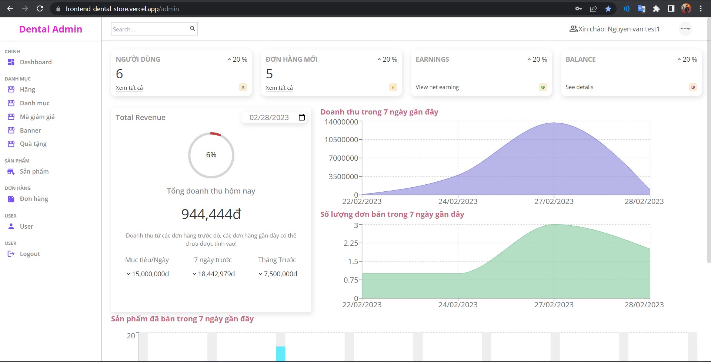
 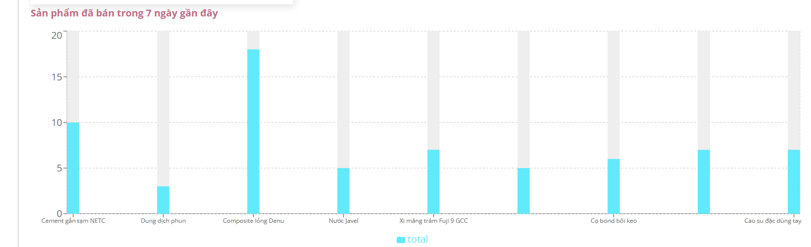
 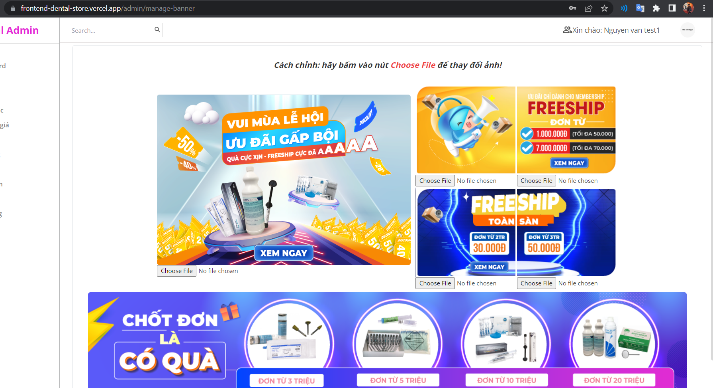
 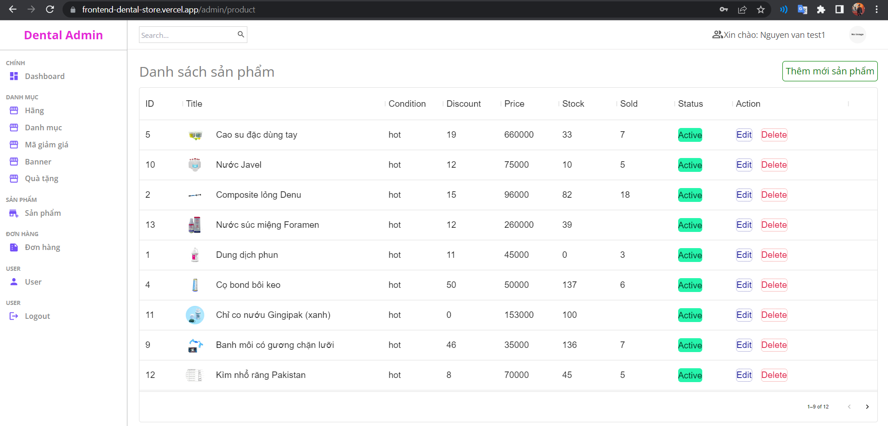
 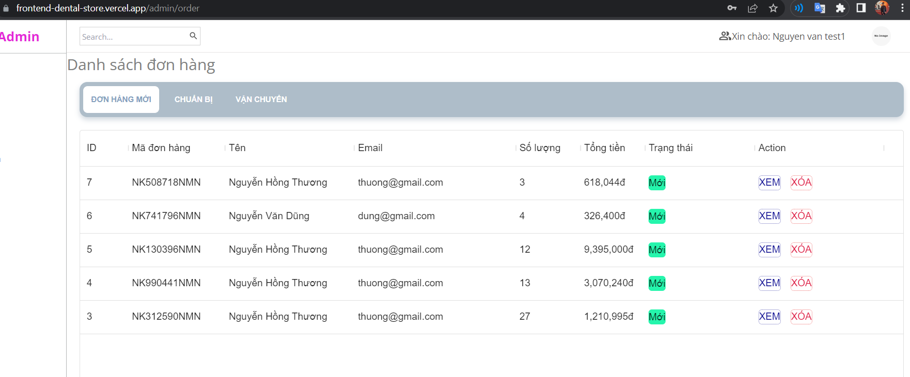
 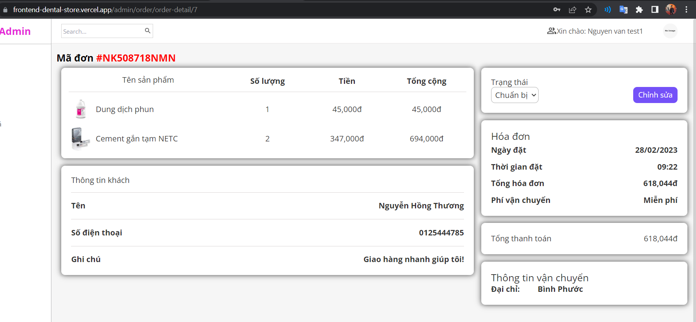
 
### `Customer`

 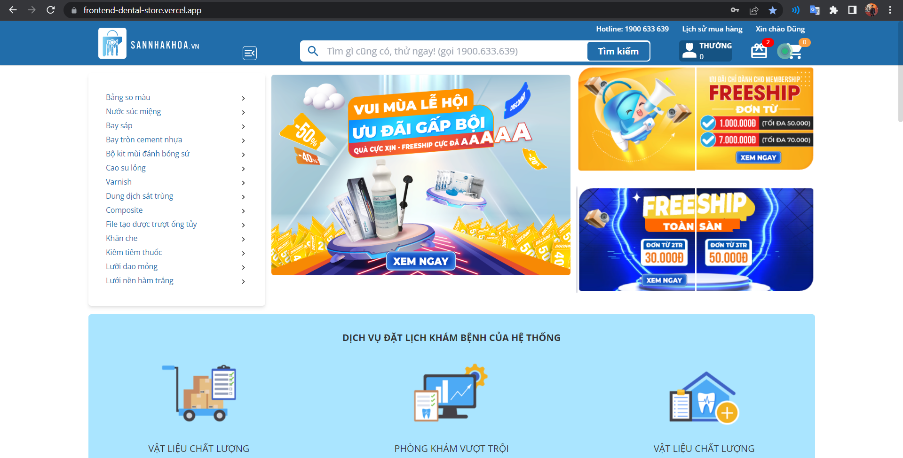
 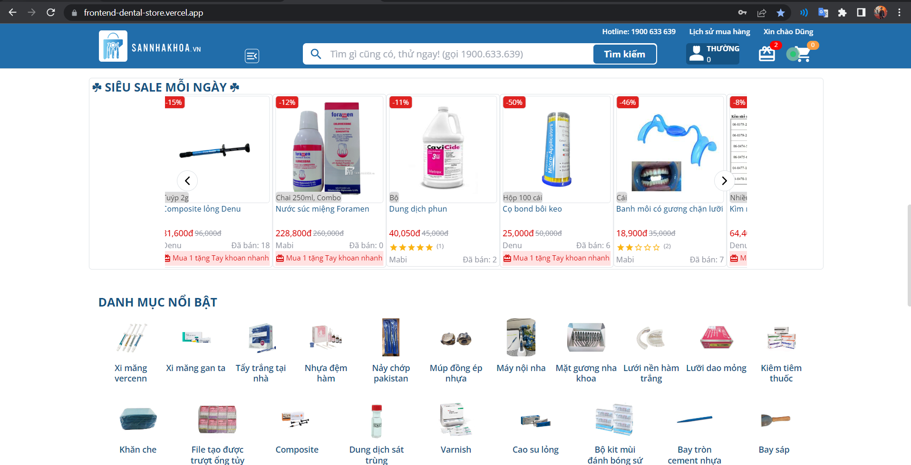
 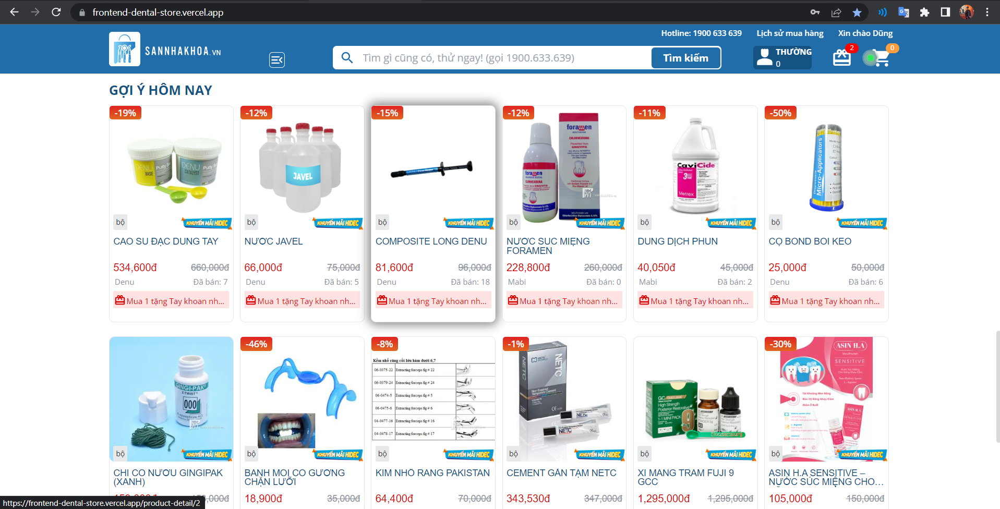
 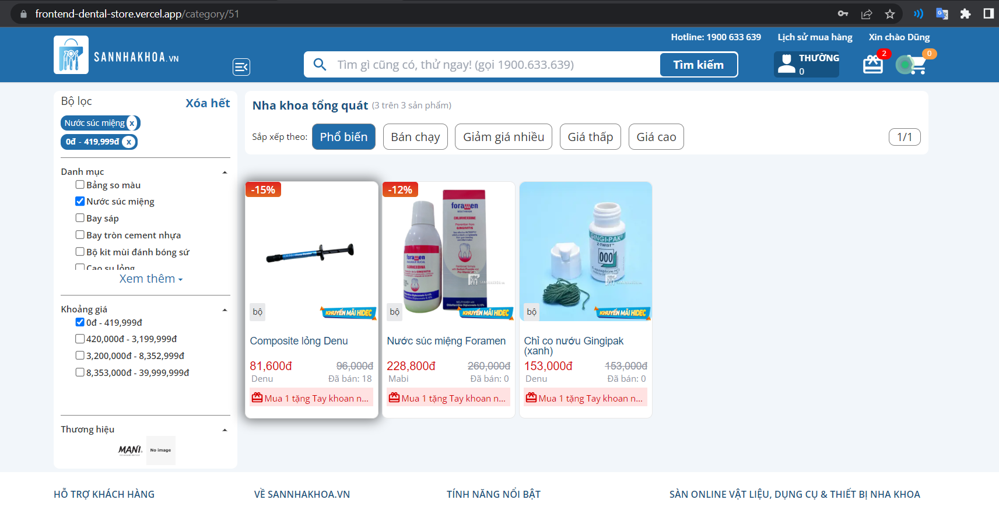
 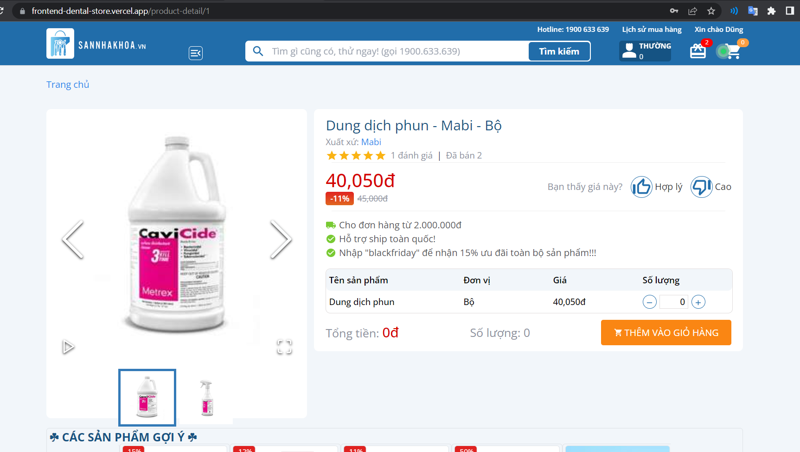
 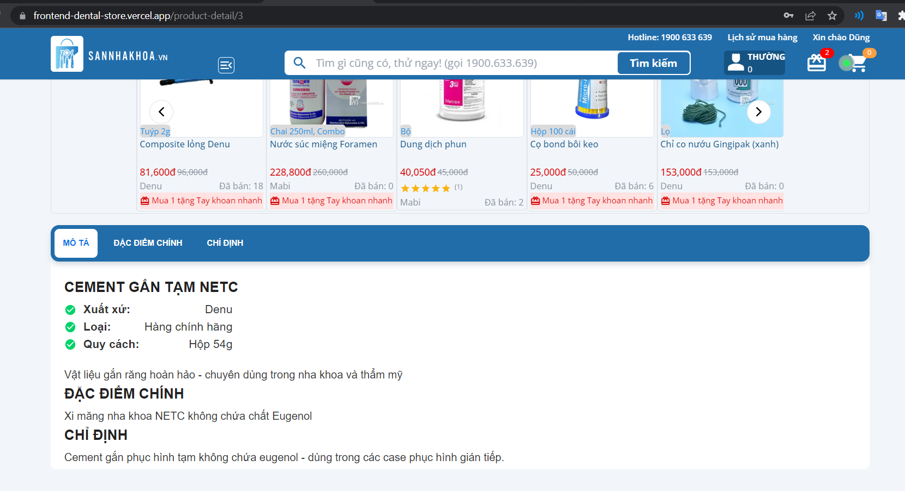
 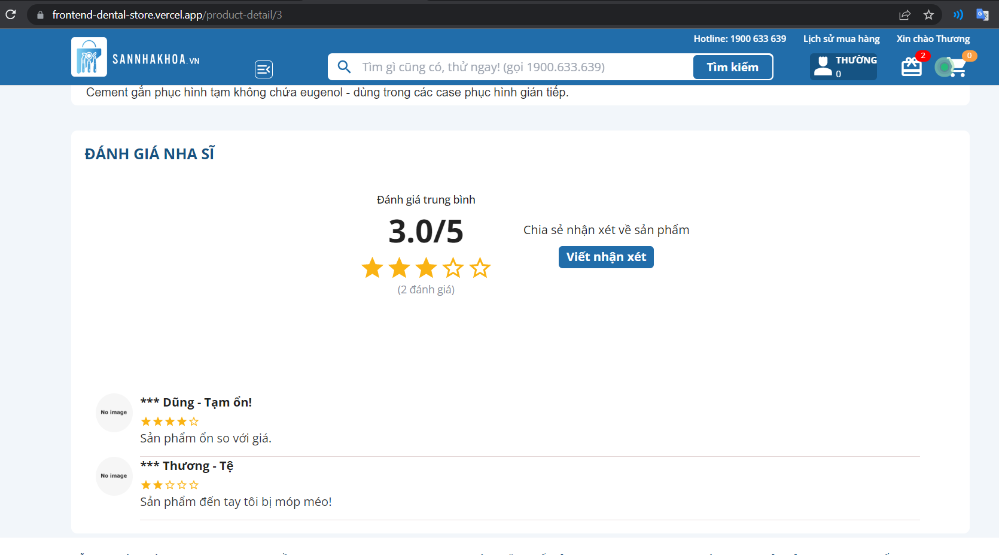
 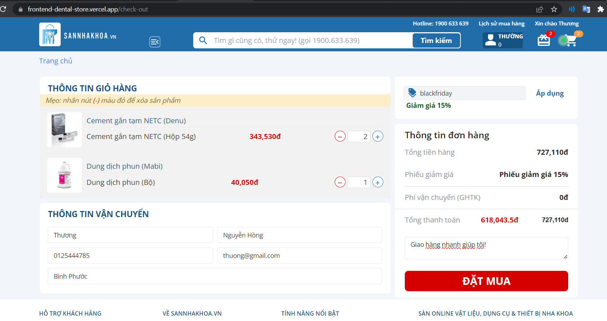
 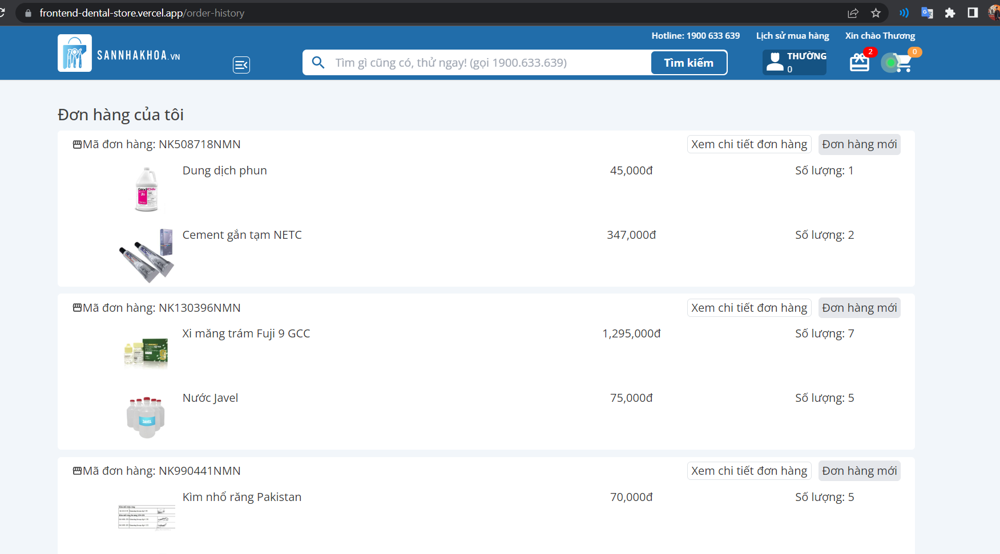

 
 ### `Thanks for watching`
 ```
  Thank you for viewing my project.
 ```


